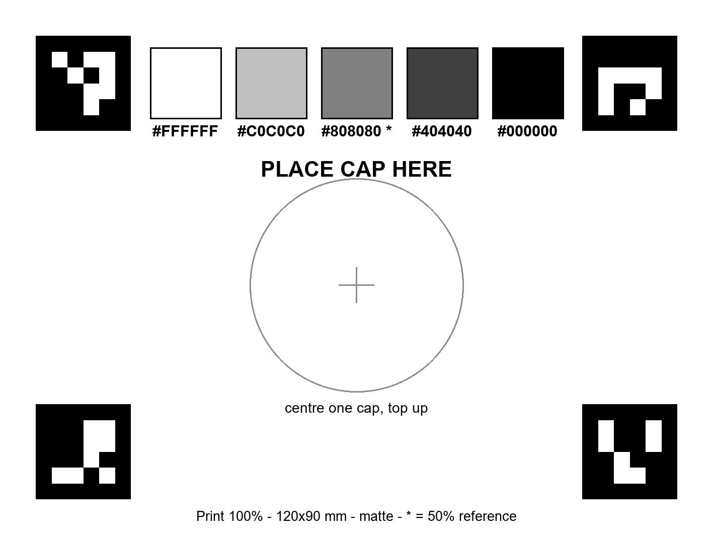
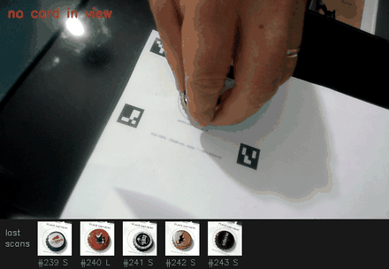

# Build your cap dataset

*From a pile of bottle caps to a colour inventory the app can plan with.*

You don't need this to try Capillisim — the app **ships with a ~100-cap example
set**, so it works the moment you clone. This guide is how you replace that
example with *your own* caps. Everything you scan lands in `dataset/`, which the
app then uses instead of the example.

You need: a printer, a webcam (or a phone camera — see
[CONNECT_PHONE.md](CONNECT_PHONE.md)), and some bottle caps.

---

## 1 · Print the reading card

The scanner reads every cap against a printed **Cap Reading Card**. Download and
print **[cap_reading_card.pdf](cap_reading_card.pdf)** at **100% / actual size**
(no "fit to page") on **matte** paper. It is 120 × 90 mm — check it with a ruler;
the footer states the scale.



The card does three jobs at once: the four corner markers give a millimetre-true
frame (so cap **size** is measured with no ruler), the gray strip colour-corrects
the shot (so a shiny silver cap doesn't read as tan), and the circle is where you
set each cap.

> Regenerate the card any time with `python -m cap_mosaic.app.make_card`.

---

## 2 · Scan

Start the app and open the scanner from the **Caps** menu → **📷 Scan caps**
(pick the camera number if you have more than one), or run it directly:

```bash
python -m cap_mosaic.app.cap_capture --out dataset --auto     # --camera 1 for a second camera
```

A window opens on your camera. Put one cap on the circle; when the reading is
steady it **auto-saves** (a two-tone beep) — then swap in the next cap. A hand in
frame or a glary frame is rejected and retried, so just keep swapping.



Keys in the scanner window: **Q** quits · **Z** removes the last scan if it looked
wrong. Each cap is stored with two colours — the *field* colour (used to
recognise the cap in your hand) and the *mosaic* colour (the linear-light mix of
the whole face, logo included, which is what it contributes to a picture from a
distance):


---

## 3 · Check the inventory

Back in the app, **Caps → 🗂 Browse** (or visit
[`/inventory`](http://127.0.0.1:8000/inventory)) shows every scanned cap with its
photo, its field | mosaic swatch, and its measured size. Filter by size, and
delete a mis-scan by clicking its **×** then **delete?**.


Click any cap for the *believe-your-eyes* test: your real cap tiled next to the
solid mosaic colour the planner will use — drag the distance back and, if the
seam disappears, that colour is what your eye actually gets.

---

## 4 · Use them

Your `dataset/` now takes precedence over the example automatically. In the
estimator's **Caps** menu you can now:

- switch **Plan the mosaic from → Only caps I own** to build a piece from your
  real stock;
- turn on the **Shopping list** to see *have / short* per colour;
- lay your caps out as a **pattern** (Image menu → "… or start from a pattern");
- copy an **📋 AI prompt** tuned to your palette to generate cap-friendly art.

Next: **[CREATE_IMAGE.md](CREATE_IMAGE.md)** — turning a picture into a buildable
cap plan.
