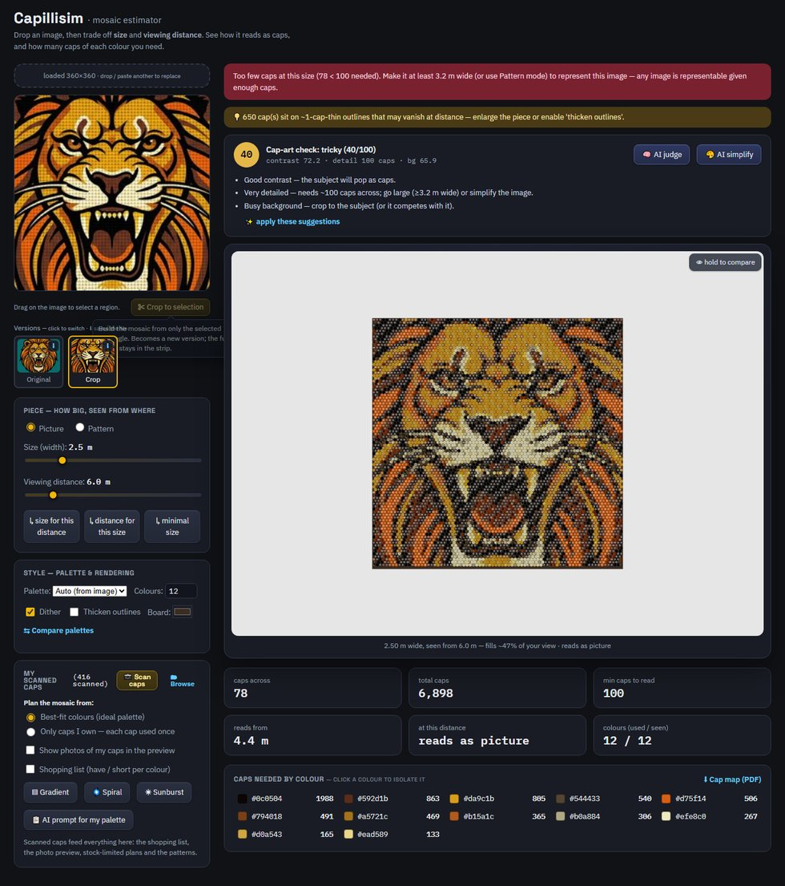
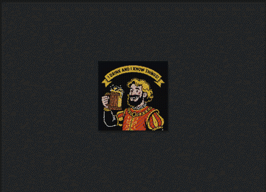
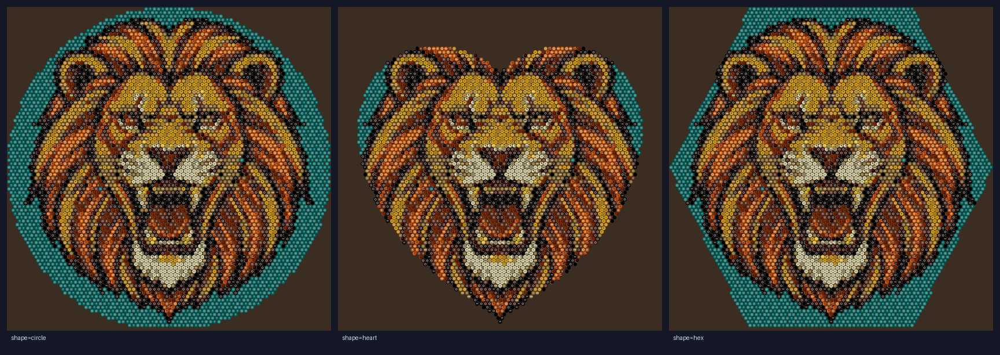

# Create the artwork

*From "I don't have a picture" to a buildable cap plan.*

Cap art is a **shouting** medium: bold shapes, high contrast, few colours. A
crisp poster reads from across the room; a subtle photo turns to mush. This guide
gets you a cap-friendly image and turns it into a plan. The app opens with a
sample already loaded, so you can follow along immediately.

---

## 1 · Get a good image in

Three ways, in order of how well they tend to work:

1. **Generate one for caps (most reliable).** In the **Caps** menu, click
   **📋 AI prompt** — it copies a prompt tuned to bold, flat, few-colour art (and,
   once you've scanned caps, to *your* palette). Paste it into any image
   generator (ChatGPT, Gemini, Midjourney), then drag the result back onto the
   app.
2. **Bring your own.** Drag & drop, click to browse, or paste with **Ctrl/Cmd+V**.
   Logos, silhouettes, skulls, sunsets, pixel art, and space/black-hole scenes
   all shine.
3. **🎨 AI simplify** *(experimental)* redraws an image flatter and cap-friendlier.
   It helps most with busy backgrounds — and can make an already-simple graphic
   *worse*, so the app tells you honestly whether the cap-art score improved. The
   original always stays one click away in the version strip.

Drag a rectangle on your image and hit **✂ Crop to selection** to build from just
part of it. Every crop and edit becomes a thumbnail you can switch back to.

---

## 2 · Listen to the judge

The moment an image loads, the **Cap-art check** scores it: contrast, the detail
floor (the minimum caps-across for the subject to read at all), and background
busyness. Its tips end with **✨ apply these suggestions** (free). For taste, the
**🧠 AI judge** adds a vision model's read and, when it recommends concrete
settings, a **🪄 apply** button — it never shrinks the piece below the readable
floor.

**The one rule that matters:** if it says *"62 < 100 needed"*, the subject cannot
read at that size. Make it bigger, or pick a bolder subject. No palette trick
saves an image below its floor.

---

## 3 · Size ↔ distance

Caps are a fixed size, so **physical width sets resolution**. Two sliders and
three solver buttons explore the trade-off, and **scrolling over the preview
walks you closer or farther** — up close you see caps, step back and they melt
into a picture:

- **↳ size for this distance** — how big to fill your view from here.
- **↳ distance for this size** — where to stand for this width.
- **↳ minimal size** — the smallest width that still reads, and the closest
  distance it reads from.

---

## 4 · Palette and look

- **Palette / Colours** — *Auto* pulls colours from the image; the presets
  (Portrait, Sunset, Space) often read bolder. Fewer colours = bolder.
  **⇆ Compare palettes** shows four at once.

  
- **Dither** — mixes adjacent caps so gradients and skin tones read from
  distance; turn it *off* for flat poster/pixel art.
- **Thicken outlines** — 1-cap-wide strokes (whiskers, eyes, skylines) vanish
  from afar; this widens them.
- **Board** — the backing colour that shows in the gaps; a dark board hides the
  seams between caps.
- **Shape** — clip the piece to a circle, heart, hexagon… or draw a freeform
  outline right on your image.

  

---

## 5 · Build artifacts

When it reads the way you want, take it to the board:

- **⬇ Cap map (PDF)** — a printable paint-by-numbers sheet: one letter per colour
  in every cell, rulers, and a legend with counts.

  
- The per-colour **bill of materials** (with *have / short* once you've scanned
  caps) is your shopping list.
- Projector + interactive placement loop: see the main
  [GUIDE](GUIDE.md#6--build-it).

## Tips that make or break a piece

- **Bold beats accurate.** A slightly wrong colour with strong contrast reads
  better than the "right" colour that blends into its neighbour.
- **Never go below the floor.** Grow it or simplify the image.
- **Outlines ≥ 2 caps.** Eyes, mouths, skylines: thicken or lose them.
- **Fewer colours than you think.** 6 well-chosen beats 12 similar.

No caps scanned yet? Start with **[BUILD_DATASET.md](BUILD_DATASET.md)**.
