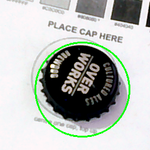
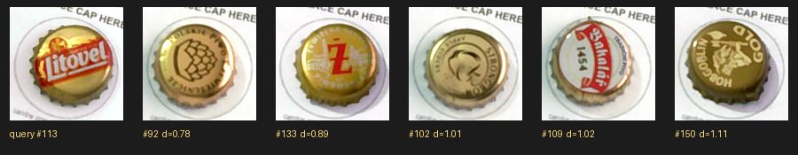

# Data Model — the cap dataset / inventory store

Date: 2026-07-03. Status: schema **v4**. Code: `src/cap_mosaic/data/store.py`.

The capture loop produces a growing set of caps, each with several
colour-corrected crops, a measured colour, a quality signal, and — later —
brand/logo features. The original `labels.csv` was throwaway scaffolding; the
real store is **SQLite** (`<dataset>/caps.db`).

## Why SQLite

- **Single file, zero dependencies** (`sqlite3` is in the Python stdlib) and
  available on a phone later — fits the portable-core goal.
- **Normalised + queryable.** One cap has many crops and many embeddings; a flat
  CSV can't hold that without losing data (the CSV stored only one colour per
  cap and dropped the per-frame reads).
- **Evolvable.** Schema version lives in `PRAGMA user_version`; `_MIGRATIONS`
  upgrades an older file in place. Opening a file *newer* than the code errors
  loudly rather than corrupting it.
- **Crops stay as files.** We store each crop's path + SHA-256, never the image
  bytes — the DB stays small and backup/inspection-friendly.

## Schema (v3)

```
cap            one physical cap and its measured colours
 ├─ id            INTEGER PK
 ├─ captured_at   TEXT  (ISO-8601 UTC)
 ├─ r,g,b         INTEGER          FIELD colour: dominant body cluster, logo
 │                                 excluded — recognises a cap in hand
 ├─ lab_l,a,b     REAL             derived CIELAB (perceptual matching/clustering)
 ├─ color_std     REAL  nullable   spread across frames = glare/outlier signal
 ├─ marking_frac  REAL  nullable   busy-ness: fraction of logo/text vs field (v2)
 ├─ mosaic_r,g,b  INTEGER nullable MOSAIC colour (v3): at-distance contribution —
 │                                 linear-light mean of the whole face, logo mixed
 │                                 in (app.cap_color); drives planning/matching
 ├─ diameter_mm   REAL nullable    physical size measured off the card's mm-true
 │                                 homography (v4); size_class derives from it
 ├─ crop_span_mm  REAL nullable    crop window width in mm (v4; legacy = 37.8) so
 │                                 mm-per-pixel stays derivable from stored crops
 ├─ n_frames      INTEGER
 ├─ source        TEXT             e.g. 'card_capture', 'labels.csv'
 ├─ brand         TEXT  nullable   future logo/brand label
 └─ notes         TEXT  nullable

frame          one colour-corrected crop (≈5 per cap)
 ├─ id           INTEGER PK
 ├─ cap_id       INTEGER FK → cap.id  (ON DELETE CASCADE)
 ├─ frame_index  INTEGER
 ├─ path         TEXT              relative crop path
 ├─ r,g,b        INTEGER nullable  this frame's glare-masked read
 ├─ lab_l,a,b    REAL   nullable
 ├─ glare_frac   REAL   nullable
 └─ sha256       TEXT   nullable   content hash (integrity / dedup)

embedding      future brand/logo or colour features (kept separate so the
 ├─ cap_id       INTEGER FK → cap.id   core schema doesn't churn when added)
 ├─ model        TEXT
 ├─ dim          INTEGER
 ├─ vec          BLOB              float32 little-endian
 ├─ created_at   TEXT
 └─ PRIMARY KEY (cap_id, model)

meta           dataset-level key/value (name, calibration ref, …)
```

## Key decisions baked in

- **True colour, no bucketing.** Capture stores measured RGB/Lab only; mapping
  caps to painting colours is a per-painting decision at plan time
  (`docs/COLOR_MATCHING.md`).
- **Robust per-cap colour.** The cap's `r,g,b` is the **median across all saved
  frames'** reads, so one glary frame can't skew it (this is what the old
  single-frame CSV value got wrong). `color_std` records the spread as a
  built-in quality flag.
- **Field colour, logo excluded.** Each frame's colour comes from
  `read_cap_field` — the dominant *field* cluster (k-means in Lab), so a cap's
  own logo/text can't tint its stored colour (a white cap with a red logo stores
  white, not pink). `marking_frac` records how busy the cap is (logo fraction),
  the cap-art "internal marking" feature used to favour busy caps for detailed
  regions and flat caps for smooth fields. See `docs/COLOR_MATCHING.md`.
- **Two colours per cap (v3).** The *field* colour recognises a cap in hand; the
  *mosaic* colour (`mosaic_r,g,b`) is what the cap contributes to the picture at
  viewing distance — the linear-light area mean of the whole face, logo mixed in
  (same optics as the distance simulator). Planner and renderer match on the
  mosaic colour (`mosaic_rgb or rgb` fallback for legacy rows); backfill with
  `python -m cap_mosaic.app.backfill_mosaic --db dataset/caps.db`.

  Real examples from the backfilled dataset (why the two colours differ):

  

  | cap | field (recognition) | mosaic (at distance) | why |
  |---|---|---|---|
  | black, small gold crest (#99) | (8, 6, 2) black | (83, 80, 59) dark bronze | gold crest + gloss mix in |
  | black, big gold logo (#110) | (51, 22, 14) | (99, 73, 58) warm bronze | large logo dominates the mix |
  | silver "Norrland" (#107) | (212, 218, 216) | (197, 202, 199) | near-identical: flat cap, mosaic ≈ field |
  | navy, pale crest (#103) | (7, 14, 65) navy | (90, 83, 85) muted gray-mauve | pale crest lifts the dark field |

  A flat single-colour cap has mosaic ≈ field; the busier the cap, the more the
  two diverge — and the mosaic value is the one the eye actually sees in the wall.
- **Capture quality gate.** A capture whose frames disagree (CIEDE2000 spread
  above `SPREAD_REJECT_DE`) is rejected at scan time — a hand still in frame,
  a wandering reflection, or glare — instead of storing a corrupted colour.
- **Capture repair (no re-scan needed).** For a capture where only some frames
  were contaminated, `app.repair_capture` drops the outlier frames and
  recomputes field + mosaic from the agreeing ones; truly corrupt captures get
  `notes='corrupt-capture'` and keep their colours as best-effort.
- **Cap size, measured not assumed (v4).** The card homography is mm-true, so
  the scanner measures each cap's diameter as it saves (`measure_cap_diameter_mm`,
  validated live at ±1 mm) and picks a wider crop window for large caps so they
  aren't clipped. `size_class` gives `standard-26` (< 33 mm — a *used* nominal-26
  crown flares to ~29–31 mm across the pried-open skirt) or `large-38` (≥ 35 mm);
  nominal 26 vs 29 mm crowns are indistinguishable once flared, so they share one
  class. Inventory can be filtered per artwork:
  `inventory_from_db(path, size_class="standard-26")`. Backfill:
  `python -m cap_mosaic.app.backfill_diameter --db dataset/caps.db`. Mixed-size
  layouts (big caps as super-pixels) are a future phase.

  

- **Re-identification (`embedding` table, model `ringsig-v1`).** Every cap gets
  a rotation-invariant ring signature (`app.cap_signature`: 8 annuli × mean Lab
  + luminance histogram). The scanner prints "likely SAME design as cap #N"
  when a new scan matches an existing cap (warn-only), and
  `python -m cap_mosaic.app.similar --db dataset/caps.db --cap N --montage out.png`
  navigates the inventory by visual similarity. Self-check protocol: scan the
  same physical cap twice under different lighting — its earlier record should
  be the top hit with score < 0.8. Backfill:
  `python -m cap_mosaic.app.backfill_signatures --db dataset/caps.db`.

  
- **A cap is one physical cap.** Inventory counts and "how many blue caps do I
  have" are *queries*, not stored buckets — consistent with the open-ended,
  random cap supply.

## API (`cap_mosaic.data.store`)

```python
from cap_mosaic.data.store import CapDataset, FrameRecord

with CapDataset("dataset/caps.db") as db:
    db.add_cap((67, 122, 150), frames=[FrameRecord(0, "crops/cap_0000_f0.png", rgb=(67,122,150))],
               captured_at="2026-06-24T12:00:00", source="card_capture")
    colors = db.colors()          # [(r,g,b), …] — inventory for palette k-means
    caps   = db.caps(with_frames=True)
    db.add_embedding(cap_id, "clip-v1", vec, created_at=...)   # future
```

Consumed by the planner via `planner_designer.inventory_from_db` /
`load_inventory` (which also reads a legacy `.csv`). `import_labels_csv` migrates
an old dataset into the DB.

## Migration path

- **v1:** colour dataset + crops + quality + embedding table (unused yet).
- **v2 (now):** `cap.marking_frac` busy-ness metric. Existing v1 files upgrade in
  place on open (`_migrate_to_v2` ALTERs the table; legacy rows get NULL).
- **Later:** populate `embedding` for brand/logo ID; add per-cap `placed`/build
  state if the store ever also tracks a live build (today that lives in the
  `.capproj.json` plan). Add columns via a new entry in `_MIGRATIONS`.
