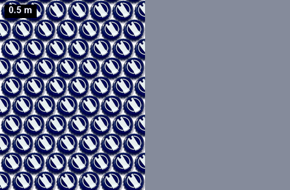
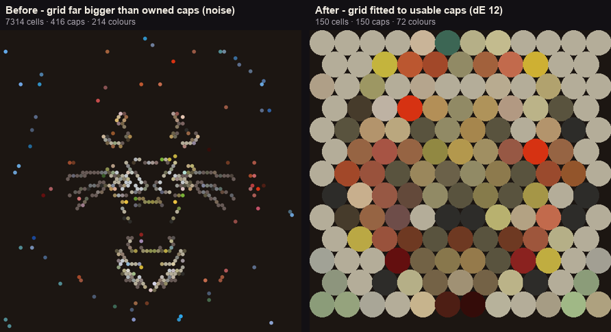

# Mosaic Estimator (web app)

Date: 2026-07-01. Code: `src/cap_mosaic/app/webapp/`, `core/estimator.py`,
`core/legibility.py`, `app/cap_render.py`, `app/fake_caps.py`.

A local web app to answer, for any image: **how big must the mosaic be, from how
far is it seen well, and how many caps of each colour does it take**, with a
realistic simulation of how it reads at a chosen size and distance.

## Run

```bash
pip install -e .[web]                      # fastapi, uvicorn, python-multipart
PYTHONPATH=src python -m cap_mosaic.app.webapp     # http://127.0.0.1:8000
```

Drag an image in, pick **Picture** or **Pattern**, then move the **size** and
**viewing-distance** sliders. Buttons solve one axis from the other ("size for
this distance" / "distance for this size").

## The model

Caps are a fixed physical size (~32 mm), so a mosaic is a heavy downsampling of
the target and only reads once you stand far enough that caps blend.

- **Legibility floor** (`core/legibility.py`): render the image at N caps-across
  and compare structure to the original (windowed SSIM); the smallest N that
  clears a threshold is the minimum caps to represent the subject. Below it the
  app warns: *won't read from any distance*. Detailed images need many more caps
  than simple ones; **Pattern** mode uses a looser threshold (no subject to
  recognise).
- **Size ↔ distance** (`core/estimator.py`):
  - *size → distance*: caps-across from the width; the **min distance** where
    caps stop being visible (they blend) and the **recommended** distance that
    fills a comfortable field of view;
  - *distance → size*: the width that fills the view at that distance, flagged if
    it falls below the legibility floor.
- **Shades merge with distance**: far away, near colours blend, so the effective
  palette shrinks (`effective_colors`); the app shows *colours used / seen*.
- **Realistic simulation** (`app/cap_render.py`, `app/fake_caps.py`,
  `planner_designer.view_at_distance`, `core/sizing.py`): the mosaic is tiled
  from actual cap images (real `dataset/caps.db` crops + procedurally generated
  fake caps with rims/logos). To show a viewing distance it is **not** blurred:
  it **shrinks inside a fixed field of view frame and stays sharp**. As it
  subtends fewer pixels, an area-resample done in **linear light** (sRGB→linear→
  area-average→sRGB) merges neighbouring caps; that is physically-correct
  optical colour mixing, so a 50/50 black+white tile averages to the linear
  midpoint (~188), not the sRGB midpoint (~128). `apparent_fraction(width,
  distance, fov)` sets how much of the ~50° frame the piece fills (shown as
  *fills ~X% of your view*). **Close up it fills your view as caps; far away it
  is a small sharp picture in bare board.**
- **Bare-white background**: cells sampled as near-white (all channels ≥
  `white_level`, default 238) are left as **bare board** (holes), not paved with
  white caps. Controlled by `plan_from_image(bare_white=...)`; on by default in
  the app, overridable with `&bare_white=false`.
- **Dither**: with `dither=true` (default on in the UI), non-hole cell colours
  come from CIELAB Floyd–Steinberg error diffusion (`core/dither.py`) instead of
  independent nearest-colour. A small palette then reproduces gradients/tones via
  a blend the eye merges at distance, rather than banding. See docs/RESEARCH.md.
- **Hold-to-compare (A/B)**: the `👁 hold to compare` button swaps the cap sim
  for the *original* image framed identically (`/target`), so you can judge how
  faithfully the caps read at the chosen size/distance.
- **Printable cap map**: `⬇ Cap map (PDF)` downloads a paint-by-numbers sheet
  (`app/cap_map.py`): a letter per colour on each cell, row/col rulers, and a
  legend (letter · hex · count). The artifact you actually build from.
- **Inventory gap**: `Shopping list (have / short per colour)` (in the "My
  scanned caps" group) matches your scanned `caps.db` against the
  BOM (greedy nearest, CIEDE2000 ≤ 12) and shows *have · short* per colour plus
  *you own X of Y needed*. Report only; the plan is not constrained by stock.
- **Cap-art check + AI judge**: every upload gets a heuristic score (contrast,
  detail floor, background simplicity) whose tips end with an inline
  `✨ apply these suggestions` link. `🧠 AI judge` (Qwen `qwen3-vl-plus`, needs
  `QWEEN_KEY`) adds an AI verdict; when it recommends **whitelisted actions**
  (colors 4–24, thicken, dither, size_m, preset; nothing else is accepted) a
  `🪄 Apply the AI's settings` button appears with the verdict and applies
  them, with a *before* snapshot kept next to the new simulation.
- **AI simplify**: `🎨 AI simplify` (qwen-image-edit-plus) edits the image
  itself into a cap-friendly version (≤6 flat colours, thickened lines, clutter
  removed, same subject) using the judge's own tips as the edit instruction.
  Stored as a NEW image in the **version strip** (Original · crops · AI edits;
  click to switch, ⬇ to save any version). Opt-in per click.

## Endpoints

- `POST /upload`: image -> `{id, width, height, aspect}`
- `GET /estimate?image_id=&size_mm=|distance_m=&mode=&colors=&bare_white=&preset=&thicken=&dither=&inventory=`
  -> caps, legibility, distances, `bom` (hex -> count), colours used/effective,
  `apparent_pct`, and (with `inventory=true`) `inventory` + `inventory_totals`
- `GET /simulate?...&bg_color=&real_caps=&real_only=&preset=&thicken=&dither=&highlight=`
  -> cap-rendered PNG of the fixed FOV frame: the sharp mosaic shrunk to the size
  it subtends at the distance, on the chosen board colour
- `GET /target?image_id=&size_mm=&distance_m=&mode=` -> the ORIGINAL image framed
  exactly like `/simulate` (for hold-to-compare)
- `GET /capmap?image_id=&...&format=pdf|png` -> printable paint-by-numbers cap map
- `GET /pick?image_id=&fx=&fy=&...` -> the cap under a click on the displayed
  /simulate PNG (fractions of the image, letterbox inverted server-side):
  `{hit, row, col, hex, color_name, fx, fy (cell centre), bare, excluded_by,
  seed_index}` — the client's basis for click-to-background
- `&bg_colors=rrggbb,...` and `&bg_seeds=fx:fy:rrggbb,...` on /estimate,
  /simulate, /capmap and /pick -> user background exclusions: whole colours or
  flood-filled connected regions become holes (bare board) and drop out of the
  BOM + shopping list. Applied as a copy-on-write overlay AFTER the cached
  plan, so the plan cache is untouched; a seed whose cell no longer carries its
  recorded colour (palette/grid changed) silently sits out that render.
- `GET /crop?image_id=&x0=&y0=&x1=&y1=` / `GET /image?image_id=` -> region crop + preview
- `GET /critique?image_id=&llm=` -> heuristic score/tips/recommendations; with
  `llm=true` also the Qwen verdict incl. whitelisted `actions`
- `GET /simplify?image_id=` -> AI-edited (simplified) copy stored as a new id
- `GET /palettes?image_id=&size_mm=` -> side-by-side preset comparison sheet
- `POST /scanner/launch` -> opens the cap-scanning camera window on the machine
  running the server (the 📷 Scan caps button)
- `&from_my_caps=true` on /estimate + /simulate -> plan against the OWNED stock
  (duplicates pooled by ring signature, greedy global dE00 assignment, counts
  respected, no reject). The grid is **fitted to the usable-cap count**, not the
  size slider: only caps within `&own_threshold=` (dE00, default 12) of a colour
  the image needs are kept, and the grid shrinks so its cell count ~ that count,
  so each owned cap fills a cell instead of drowning in holes (see below).
  /estimate adds `stock_used {used, owned, usable}` and reports the fitted piece's
  `caps_across` / `width_mm`.
- `GET /pattern?kind=gradient|spiral|sunburst` -> the whole inventory laid out
  as a pattern (every cap exactly once), stored as a new image id
- `GET /palette_prompt` -> a paste-anywhere AI prompt constrained to the owned
  palette + cap count
- `GET /inventory` -> the cap-inventory browser page; `GET /inventory/caps`
  (JSON, newest first), `GET /inventory/crop/{id}` (thumbnail),
  `DELETE /inventory/caps/{id}` (removes the row AND its crop files). Linked
  from the "My scanned caps" group: browse every scanned cap (photo,
  field|mosaic swatch bar, mm + S/L class, size filters) and delete a mis-scan
  with the mouse — click ×, then `delete?`; clicking anywhere else cancels.
- `GET /inventory/test/{id}?distance_m=&bg=` -> the believe-your-eyes colour
  test (click any cap in the browser): a CONSTANT-size frame, LEFT half the
  cap's real photo tiled, RIGHT half the solid mosaic colour the planner
  stores for it. The coloured area never shrinks into bare board; a larger
  `distance_m` fits MORE, SMALLER caps into the same window (`caps_across ∝
  distance`), a real zoom-out — so far away the tiled half is fine cap texture
  that reads as the swatch colour, not a magnified blob. The distance is
  labelled on the frame. If the two halves match, the stored mosaic colour is
  what the eye gets from that cap in a wall. Cap tiles are cut GEOMETRY-DRIVEN
  (`cap_crop.cap_circle` with the cap's known class size over the crop span):
  centre from the distance-transform peak or narrow-band Hough (white caps are
  invisible to thresholds), radius from the steepest radial-brightness step
  under a size prior — so tiles meet at the metal edge like really glued caps.

The inventory browser and the colour test (a constant-frame zoom-out: more,
smaller caps fit the window as you step back, until they read as the swatch):




## Only caps I own (fit to inventory)

"Only caps I own" builds the mosaic from the caps you actually have. The trap it
avoids: the size slider sets a grid of thousands of cells, but you own only a few
hundred caps, so the stock assignment fills a sprinkle of cells and leaves the
rest as holes — noise, not a picture (left below: 416 caps lost in a 7314-cell
grid, all 214 colours firing at random).

The fix has three parts, all in the caps-I-own path of `webapp/server.py::_plan`:

1. **k-means the image** for the colours it needs (`filter_k = max(colours, 16)`
   CIELAB centroids).
2. **Keep only usable caps** — `usable_groups(groups, image, own_threshold,
   filter_k)` drops any owned group whose mean colour is farther than
   `own_threshold` (dE00, default 12) from every needed colour. Off-colour caps
   stay in the box. The **Match tolerance (dE)** slider (2..30) drives this live:
   lower = only near-perfect matches qualify (a smaller, truer piece); higher =
   looser matches join in (bigger, muddier). `|usable|` is monotone in the
   threshold.
3. **Fit the grid to that count** — `fit_caps_across(X, aspect)` sizes the grid so
   its cell count ~ the usable-cap count `X`, overriding the size slider's
   resolution. Each owned cap gets a cell; the BOM shows only the colours used.

The readout under the mode ("using X of Y caps · N colours") and the piece size
both move as you drag the slider.



## Building from caps (projector)

Once you have a `.capproj.json` plan, `app/project_plan.py` projects it onto the
board (`procam/render.render_stencil`): **S** lights every cell in its cap colour
(a 1:1 stencil: drop each cap on its disc); **C** / **N** / **P** light one
colour at a time so you glue a whole colour before moving on; **Q** quits. Display
and keys are injected callables (headless-tested); `main` drives the real
fullscreen projector. On-rig calibration + verification is still pending.

## Limitations / next

- SSIM legibility threshold is a heuristic (exposed for calibration on real
  images). Pattern/picture is a manual toggle; recognition comes later.
- Online cap datasets (Kaggle, images.cv) are deferred: they need auth +
  licensing review; the POC uses procedural + captured caps.
- Plan/BOM resolution is capped (`_MAX_CAPS_ACROSS`) to keep the UI responsive.

## Known gaps

The distance model captures shrink + optical (acuity-bounded) blending in linear
light. Left for later:

- **Contrast sensitivity (CSF).** Real acuity depends on contrast, not just
  angular size; a full model would fold in the contrast-sensitivity function.
  We use a fixed acuity (`ACUITY_ARCMIN ≈ 1.5`) as the optical limit.
- **`read_quality` vs optical acuity.** `read_quality` is a coarse
  *perceptual-integration* heuristic (when the brain fuses tiles into a subject),
  a different thing from the optical area-resample; the two are not yet unified.
- **White subject vs white background.** Bare-white holing can't tell a white
  *subject* from a white *background*; it drops both. A subject/background
  segmentation would disambiguate.
- **Gloss & lighting.** Cap gloss, specular highlights, and ambient lighting are
  out of scope; the simulation assumes flat, evenly-lit matte tiles.
