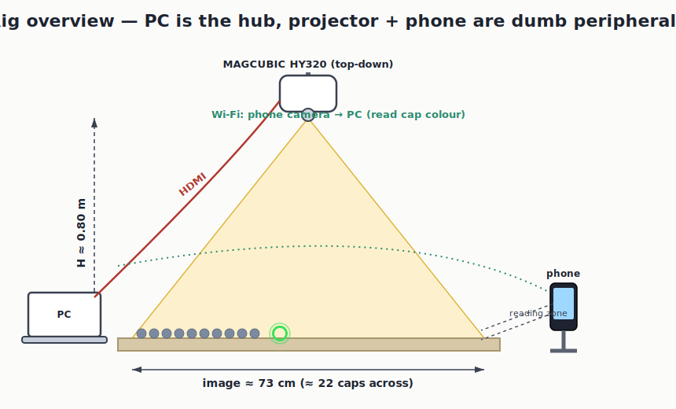
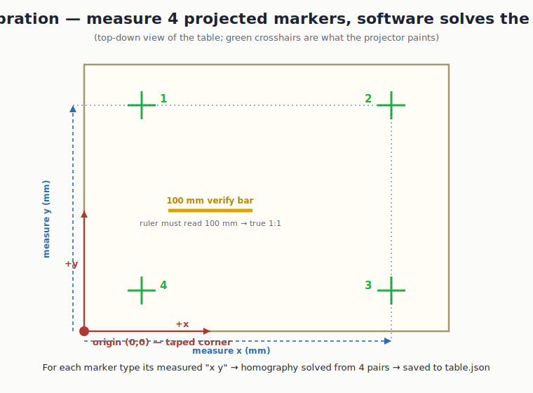
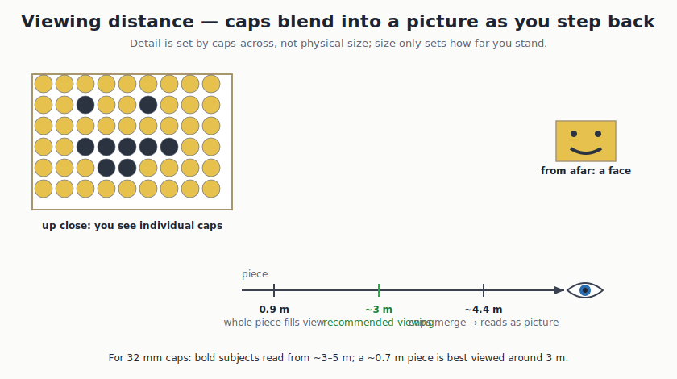

# Rig Setup — start to finish

The one-page checklist to go from boxes to building, the first time. It chains
the hardware, the calibration, and the live loop. Deeper detail lives in
[`CALIBRATION.md`](CALIBRATION.md) and [`SIZING_AND_VIEWING.md`](SIZING_AND_VIEWING.md).

## How the rig is wired

The PC is the hub. The projector is just a second monitor on HDMI; the phone is
just a wireless webcam on Wi-Fi. Nothing custom runs on either.



## 0. What you need

- PC (this machine) + the **MAGCUBIC HY320** projector + an **HDMI cable**.
- A way to hang the projector **pointing straight down** ~0.8 m over a flat table.
- Your Android phone with **IP Webcam** running (see [`CONNECT_PHONE.md`](CONNECT_PHONE.md)).
- A **tape measure** and a **ruler**.
- `pip install opencv-python` (only the projector display needs it).

## 1. Mount the projector

Hang it **straight down**, lens ~**0.80 m** above the table (gives a sharp
~73 × 41 cm image, ~22 caps across — see the table in
[`SIZING_AND_VIEWING.md`](SIZING_AND_VIEWING.md) to pick another height). Keep it
from moving once placed — any nudge means re-calibrating.

## 2. Connect it as a second screen

1. HDMI from PC → projector.
2. Windows: **Settings → System → Display → Extend these displays**.
3. Note the projector's **virtual-desktop X offset** = the width of your primary
   screen (e.g. **1920** if the laptop is 1920 wide and the projector is the
   screen to its right). You pass this as `--display-x`. If unsure, run the next
   step with `--display-x 0` first and watch which screen the markers land on.

## 3. Confirm the phone link

Phone and PC on the **same Wi-Fi** (or the phone's hotspot). Start IP Webcam,
enable *Prevent device from sleeping*, and confirm the snapshot works:

```bash
PYTHONPATH=src python -m cap_mosaic.app.camera_check \
    --url "http://user:pass@<phone-ip>:8080/shot.jpg" --center 0.5
```

A username with `@` (an email) must be percent-encoded as `%40`.

## 4. Calibrate projector → table

This is the only spatial setup. The software projects four markers; you measure
where each lands and type it in; it solves the mapping and verifies 1:1.



```bash
PYTHONPATH=src python -m cap_mosaic.app.calibrate \
    --out calibration/table.json --display-x 1920
```

Pick a taped corner as origin (+x right, +y away from you, mm), measure each
crosshair centre, type `x y` for each. Then measure the yellow **100 mm bar** with
a ruler — it must read 100 mm. Full detail in [`CALIBRATION.md`](CALIBRATION.md).
**Can it be automatic?** Yes, eventually — a printed ArUco board + the phone
camera could solve it with no tape measure, but that needs camera-to-table
registration (an M4 feature). The 4-point measure is the fast first-light path.

## 5. Make a plan (the design)

Pick a **bold, landscape** subject and size it to your piece. Detail = caps
across, not physical size.

```bash
PYTHONPATH=src python -m cap_mosaic.app.cli design --image yourpic.jpg \
    --caps-across 22 --cap-diameter 32 \
    --out plans/piece.capproj.json --preview-dir previews --distances 1 3 6
```

Check `previews/` to see how it reads before committing to a cap count.

## 6. Run the live build

```bash
PYTHONPATH=src python -m cap_mosaic.app.run_build \
    --plan plans/piece.capproj.json \
    --calibration calibration/table.json \
    --url "http://user:pass@<phone-ip>:8080/shot.jpg" \
    --display-x 1920 --center 0.5 --show-camera
```

Hold a cap in the reading zone (just outside the projector beam so its light
doesn't tint the colour). A **green ring** lights the slot to drop it in; no ring
means "set this cap aside." Keys (focus the projector window): **SPACE** = placed
→ next, **S** = skip, **Q/Esc** = quit. State saves to the plan file after every
placement, so you can stop and resume across sessions.

## 7. How far to stand back



With 32 mm caps a bold subject reads from **~3–5 m**; a ~0.7 m piece looks best
around **3 m**. Build in a **dim** room (500 ANSI lumens) so the rings show;
the finished, glued piece is viewed in normal light.

## Each new session

If nothing moved, just reload `calibration/table.json` and run step 6. If the
projector or table shifted at all, redo step 4 first (≈1 minute).
